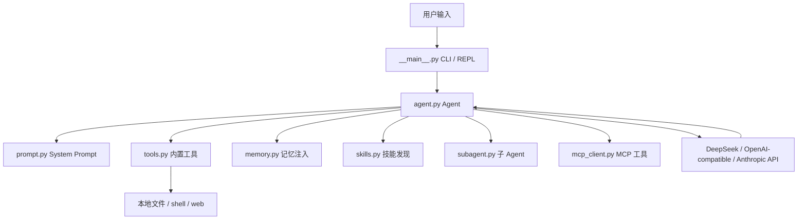
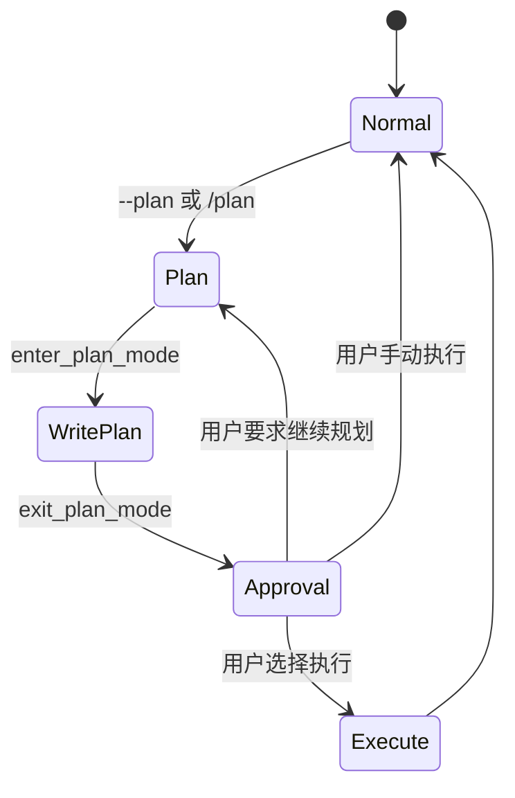

# 🎯 Python 版 Mini Claude Code 从零复刻教学大纲

这份大纲面向已经会基础 Python，但还没有系统写过 Coding Agent 的学习者。目标不是只读懂源码，而是从一个空目录开始，按阶段把项目搭建到和当前 `python/mini_claude` 基本一致的结构、命令行体验和核心能力。

学习路线采用“先闭环，再扩展”的顺序：先做一个能和模型对话、能调用工具、能把工具结果喂回模型的最小 Agent，然后逐步加入 CLI、权限、流式输出、上下文压缩、记忆、技能、子 Agent、MCP 和测试清单。

| 阶段 | 核心问题 | 最终产物 |
|------|---------|----------|
| 0. 准备工程骨架 | Python 包如何从空目录变成可安装 CLI？ | `pyproject.toml`、`mini_claude/__main__.py` |
| 1. 最小 Agent Loop | Coding Agent 为什么需要循环？ | `agent.py` 的最小闭环 |
| 2. 工具系统 | 模型如何安全地读文件、写文件、跑命令？ | `tools.py` |
| 3. Prompt 与项目规则 | System Prompt 如何注入项目上下文？ | `prompt.py` |
| 4. CLI 与 REPL | 如何做 one-shot 和交互式命令行？ | `__main__.py`、`ui.py` |
| 5. 流式与双后端 | 如何兼容 Anthropic 和 OpenAI 格式？ | `agent.py` 的 streaming 分支 |
| 6. 权限与安全 | 如何控制文件编辑和 shell 执行风险？ | 权限模式、规则、危险命令检测 |
| 7. 上下文管理 | 消息太长时如何压缩而不断开工具配对？ | 4 层压缩策略 |
| 8. 记忆系统 | Agent 如何跨会话保留项目知识？ | `memory.py` |
| 9. 技能系统 | 如何加载 `SKILL.md` 并让模型按需调用？ | `skills.py` |
| 10. Plan Mode | 如何先规划再执行？ | plan 文件与审批流 |
| 11. 子 Agent | 如何让一个 Agent 派生另一个 Agent？ | `subagent.py` |
| 12. MCP | 如何连接外部工具服务器？ | `mcp_client.py` |
| 13. 验收测试 | 怎么确认复刻结果和本项目一致？ | 手动测试清单 |

---

## 0. 总览架构



> 💡 一句话总结：这个项目的主线是 `CLI -> Agent Loop -> LLM -> tool_use -> execute_tool -> tool_result -> LLM`，其他模块都是围绕这条闭环做工程增强。

---

## 1. 第 0 课：环境与工程骨架

### 学习目标

理解 Python CLI 项目的最小组成：包目录、依赖声明、入口函数、可编辑安装。

### 从零创建

最终要搭出的目录：

```text
python/
  pyproject.toml
  mini_claude/
    __init__.py
    __main__.py
```

### 对应源码

| 文件 | 作用 |
|------|------|
| `python/pyproject.toml` | 声明包名、Python 版本、依赖、命令行入口 |
| `python/mini_claude/__main__.py` | CLI 参数解析、REPL、Agent 初始化 |
| `python/mini_claude/__init__.py` | 包版本与包标识 |

### 实操任务

1. 创建 `pyproject.toml`，要求 Python `>=3.11`。
2. 添加依赖：先使用 `openai`、`python-dotenv` 跑通 DeepSeek；后续再补 `anthropic`、`rich`。
3. 配置脚本入口：`mini-claude-py = "mini_claude.__main__:main"`。
4. 实现一个最小 `main()`，先只打印欢迎信息。
5. 执行 `pip install -e .`，确认 `mini-claude-py` 可运行。

### 验收标准

```bash
cd python
pip install -e .
mini-claude-py --help
python -m mini_claude --help
```

能看到帮助信息，说明工程骨架成立。

---

## 2. 第 1 课：最小 Agent Loop

### 学习目标

理解 Coding Agent 和普通聊天机器人的差别：Agent 不是只调用一次模型，而是持续处理模型返回的 `tool_use`，把工具结果包装成 `tool_result` 后再交给模型。

### 要实现的能力

先支持 DeepSeek 的 OpenAI 兼容风格：

```text
用户输入
  -> messages 追加 user
  -> 调用模型
  -> 如果返回 text，打印
  -> 如果返回 tool_use，执行工具
  -> 把 tool_result 追加回 messages
  -> 继续下一轮
```

### 对应源码

| 文件 | 关注位置 |
|------|----------|
| `python/mini_claude/agent.py` | `Agent.__init__()`、`chat()`、后续拆分出的 `_chat_openai()` / `_chat_anthropic()` |
| `python/mini_claude/tools.py` | `execute_tool()` |
| `examples/01-agent-loop/agent_loop_demo.py` | 最小循环示例 |

### 实操任务

1. 创建 `Agent` 类，保存 `model`、`messages`、`system_prompt`。
2. 实现 `chat(user_message)`，把用户消息放进历史。
3. 调用模型 API，拿到 `content` blocks。
4. 识别 `text` block 并输出。
5. 识别 `tool_use` block，调用 `execute_tool()`。
6. 把工具结果以 `tool_result` 格式放回下一轮 `user` 消息。

### 关键验收

让模型完成一个必须读文件的任务，例如：

```bash
mini-claude-py --yolo "Read pyproject.toml and tell me the package name."
```

预期：模型先调用 `read_file`，再根据文件内容回答包名。

---

## 3. 第 2 课：工具系统

### 学习目标

掌握工具系统的三层结构：工具声明、工具实现、工具执行分发。

### 要实现的工具顺序

| 顺序 | 工具 | 先学原因 |
|------|------|----------|
| 1 | `read_file` | Agent 观察项目的入口 |
| 2 | `list_files` | 让模型发现文件 |
| 3 | `grep_search` | 让模型定位代码 |
| 4 | `write_file` | 支持创建文件 |
| 5 | `edit_file` | 支持精确修改 |
| 6 | `run_shell` | 支持测试和构建 |
| 7 | `web_fetch` | 支持网页内容读取 |
| 8 | `tool_search` | 支持延迟工具激活 |
| 9 | `skill` | 支持技能调用 |
| 10 | `agent` | 支持子 Agent |
| 11 | `enter_plan_mode` / `exit_plan_mode` | 支持规划模式 |

### 对应源码

| 文件 | 关注位置 |
|------|----------|
| `python/mini_claude/tools.py` | `tool_definitions`、`execute_tool()`、各 `_xxx()` 工具函数 |
| `python/mini_claude/ui.py` | 工具调用与工具结果展示 |

### 实操任务

1. 先写 `tool_definitions`，每个工具都要有 JSON Schema。
2. 实现 `_read_file()`，返回带行号的内容。
3. 实现 `_list_files()`，支持 glob。
4. 实现 `_grep_search()`，优先调用系统搜索，不可用时回退 Python 遍历。
5. 实现 `_write_file()`，自动创建父目录。
6. 实现 `_edit_file()`，要求 `old_string` 唯一匹配。
7. 实现 `_run_shell()`，支持超时。
8. 实现 `_web_fetch()`，对 HTML 做简单清洗。
9. 实现 `_truncate_result()`，避免超大结果撑爆上下文。

### 重点概念

| 概念 | 在项目里的落点 |
|------|----------------|
| 工具声明 | `tool_definitions` 发给模型 |
| 工具实现 | `_read_file()` 等 Python 函数 |
| 工具分发 | `execute_tool()` 按 name 调用 |
| 并发安全 | `CONCURRENCY_SAFE_TOOLS` |
| 延迟加载 | deferred tools 与 `tool_search` |

### 验收标准

执行以下任务，观察模型是否能正确选工具：

```bash
mini-claude-py --yolo "List all Python files, then read python/mini_claude/session.py."
mini-claude-py --yolo "Search for the function build_system_prompt in this project."
```

---

## 4. 第 3 课：System Prompt 与项目规则

### 学习目标

理解 Agent 的行为不是只靠模型本身，而是靠 System Prompt 注入工程约束、工具规则、项目上下文、记忆、技能和子 Agent 描述。

### 对应源码

| 文件 | 作用 |
|------|------|
| `python/mini_claude/prompt.py` | 构建完整 System Prompt |
| `AGENTS.md` / `CLAUDE.md` | 项目级说明 |
| `.claude/rules/*.md` | 自动加载规则 |

### 实操任务

1. 编写 `SYSTEM_PROMPT_TEMPLATE`。
2. 注入当前工作目录、日期、平台、shell。
3. 实现 `load_claude_md()`，从当前目录向上查找 `CLAUDE.md`。
4. 实现 `@./path`、`@~/path`、`@/path` include 解析。
5. 实现 `.claude/rules/*.md` 自动加载。
6. 注入 git 分支、最近提交、工作区状态。
7. 注入记忆、技能、子 Agent、延迟工具说明。

### 学习提醒

这个模块不要一上来追求完整。建议分三版：

| 版本 | 只做什么 |
|------|----------|
| v1 | 固定 system prompt |
| v2 | 注入 cwd、date、platform、shell |
| v3 | 加入 CLAUDE.md、rules、git、memory、skills、agents |

### 验收标准

在项目根目录放入一条规则：

```text
When the user greets you, respond in Chinese.
```

然后运行：

```bash
mini-claude-py "Hello"
```

预期：模型遵守项目规则，用中文回应。

---

## 5. 第 4 课：CLI、REPL 与终端 UI

### 学习目标

把 Agent 包装成真实命令行工具，支持一次性任务、交互式对话、内置命令、Ctrl+C 中断。

### 对应源码

| 文件 | 作用 |
|------|------|
| `python/mini_claude/__main__.py` | 参数解析、REPL、session resume |
| `python/mini_claude/ui.py` | Rich 终端输出 |
| `python/mini_claude/session.py` | 会话保存与恢复 |

### 参数设计

| 参数 | 作用 |
|------|------|
| `prompt` | one-shot 模式 |
| `--yolo` | 跳过确认 |
| `--plan` | 进入规划模式 |
| `--accept-edits` | 自动批准文件编辑 |
| `--dont-ask` | CI 模式，自动拒绝确认 |
| `--thinking` | 启用扩展思考 |
| `--model` | 指定模型 |
| `--api-base` | 指定 OpenAI 兼容后端 |
| `--resume` | 恢复上次会话 |
| `--max-cost` | 成本上限 |
| `--max-turns` | 轮次上限 |

### REPL 命令

| 命令 | 对应功能 |
|------|----------|
| `/clear` | 清空历史 |
| `/plan` | 切换 plan mode |
| `/cost` | 查看 token 和费用 |
| `/compact` | 手动压缩上下文 |
| `/memory` | 查看记忆 |
| `/skills` | 查看技能 |
| `/<skill>` | 调用用户可见技能 |

### 验收标准

```bash
mini-claude-py
/cost
/skills
/clear
exit
```

预期：每个命令都有明确反馈，不会触发普通模型对话。

---

## 6. 第 5 课：DeepSeek/OpenAI 兼容接口与 Anthropic 双后端

### 学习目标

理解同一个 Agent Loop 如何适配两种工具调用协议。

### 对应源码

| 文件 | 关注位置 |
|------|----------|
| `python/mini_claude/agent.py` | `_chat_openai()`、`_chat_anthropic()`、`_to_openai_tools()` |
| `python/mini_claude/__main__.py` | API key 与 base url 解析 |

### 实操任务

1. DeepSeek/OpenAI 兼容路径：使用 `openai.AsyncOpenAI`，从 `.env` 读取 `DEEPSEEK_API_KEY`。
2. Anthropic 路径：后续使用 `anthropic.AsyncAnthropic` 补齐双后端。
3. 写 `_to_openai_tools()`，在需要时把 Anthropic 风格工具 schema 转成 OpenAI function schema。
4. 分别维护 `_anthropic_messages` 和 `_openai_messages`。
5. 统一工具执行结果，让上层体验一致。

### 差异对照

| 维度 | Anthropic | OpenAI 兼容 |
|------|-----------|-------------|
| 工具声明字段 | `input_schema` | `function.parameters` |
| 工具调用 block | `tool_use` | `tool_calls` |
| 工具结果 | `tool_result` | `role=tool` |
| system prompt | 单独传入 | 通常作为 system message |

### 验收标准

```bash
DEEPSEEK_API_KEY=sk-xxx mini-claude-rebuild --model deepseek-v4-flash "hello"
ANTHROPIC_API_KEY=sk-ant-xxx mini-claude-rebuild --model claude-opus-4-6 "hello"
```

两条路径都能完成普通对话和工具调用。

---

## 7. 第 6 课：流式输出与并行工具执行

### 学习目标

让用户边看模型输出，边让只读工具提前执行，减少等待。

### 对应源码

| 文件 | 关注位置 |
|------|----------|
| `python/mini_claude/agent.py` | `_call_anthropic_stream()`、`_call_openai_stream()` |
| `python/mini_claude/tools.py` | `CONCURRENCY_SAFE_TOOLS` |

### 实操任务

1. 处理流式 text delta，实时打印。
2. 处理流式 tool input delta，拼出完整 JSON 参数。
3. 当只读工具完整时，尽早启动工具任务。
4. 对多个只读工具使用 `asyncio.gather()` 并发执行。
5. 对写文件、跑 shell 等有副作用工具保持受控执行。

### 验收标准

让模型同时读取多个文件：

```bash
mini-claude-py --yolo "Read python/mini_claude/frontmatter.py, python/mini_claude/session.py, and python/mini_claude/skills.py, then compare their responsibilities."
```

预期：多个 read-only 工具可以并行完成。

---

## 8. 第 7 课：权限系统与安全保护

### 学习目标

实现 5 种权限模式，让 Agent 可以在交互式、自动化、只读规划等场景下工作。

### 对应源码

| 文件 | 关注位置 |
|------|----------|
| `python/mini_claude/tools.py` | `check_permission()`、`load_permission_rules()`、`is_dangerous()` |
| `python/mini_claude/agent.py` | `_execute_tool_call()`、`_confirm_dangerous()` |

### 权限模式

| 模式 | 文件读 | 文件写 | shell | 用途 |
|------|--------|--------|-------|------|
| `default` | 自动允许 | 需要确认 | 危险命令确认 | 日常交互 |
| `plan` | 允许只读 | 只允许写 plan 文件 | 禁止 | 先规划 |
| `acceptEdits` | 自动允许 | 自动允许 | 危险命令确认 | 自动改代码 |
| `bypassPermissions` | 自动允许 | 自动允许 | 自动允许 | 测试或信任环境 |
| `dontAsk` | 自动允许 | 自动拒绝需确认项 | 自动拒绝需确认项 | CI |

### 实操任务

1. 定义 `READ_TOOLS`、`EDIT_TOOLS`。
2. 实现危险命令正则，例如删除、格式化磁盘、强制 reset。
3. 实现 `.claude/settings.json` 和 `~/.claude/settings.json` 的 allow/deny 规则。
4. 实现 read-before-edit：未读文件不可直接编辑。
5. 文件被读后如果 mtime 改变，要求重新读取。

### 验收标准

```bash
mini-claude-py --plan "Edit README.md and add a section."
mini-claude-py --dont-ask "Change README.md."
mini-claude-py --accept-edits "Read README.md then fix a typo."
```

预期：三种模式的行为不同，且符合权限表。

---

## 9. 第 8 课：上下文压缩与大结果处理

### 学习目标

理解长对话中的上下文问题：不能无限把所有工具结果塞给模型，也不能破坏 `tool_use` 与 `tool_result` 的配对。

### 对应源码

| 文件 | 关注位置 |
|------|----------|
| `python/mini_claude/agent.py` | `_run_compression_pipeline()`、`_compact_anthropic()`、`_compact_openai()` |

### 4 层压缩策略

| 层级 | 方法 | 目的 |
|------|------|------|
| 1 | 大结果落盘 | 超大工具结果保存到磁盘，只给预览 |
| 2 | token budget 截断 | 对工具结果做预算控制 |
| 3 | stale result snip | 旧工具结果替换为占位文本 |
| 4 | auto compact | 调用模型总结历史 |

### 实操任务

1. 统计输入输出 token，先可用粗略字符估算。
2. 实现 `_persist_large_result()`，把大结果写入 `~/.mini-claude/...`。
3. 实现 `SNIP_PLACEHOLDER`，替换过旧工具结果。
4. 实现 `compact()`，用模型总结历史。
5. 保证压缩时不拆散工具调用和工具结果。

### 验收标准

```bash
mini-claude-py --yolo "Read test/large-file.txt and summarize it."
```

预期：超大文件不会完整塞进上下文，而是保存完整结果并展示预览。

---

## 10. 第 9 课：会话持久化

### 学习目标

让 Agent 退出后可以恢复上次对话。

### 对应源码

| 文件 | 作用 |
|------|------|
| `python/mini_claude/session.py` | 保存、读取、列出会话 |
| `python/mini_claude/agent.py` | `_auto_save()`、`restore_session()` |
| `python/mini_claude/__main__.py` | `--resume` |

### 实操任务

1. 在 `~/.mini-claude/sessions` 下保存 JSON。
2. 保存 Anthropic 和 OpenAI 两套消息历史。
3. 每轮对话后自动保存。
4. `--resume` 找到最近 session 并恢复。

### 验收标准

```bash
mini-claude-py "Remember this phrase for the current session: blue build."
mini-claude-py --resume "What phrase did I mention?"
```

预期：第二次启动能恢复上一轮上下文。

---

## 11. 第 10 课：记忆系统

### 学习目标

让 Agent 不只记住当前 session，还能保存长期项目知识，并在相关任务中自动召回。

### 对应源码

| 文件 | 关注位置 |
|------|----------|
| `python/mini_claude/memory.py` | `save_memory()`、`list_memories()`、`select_relevant_memories()` |
| `python/mini_claude/frontmatter.py` | frontmatter 解析 |
| `python/mini_claude/tools.py` | 写 memory 文件后自动更新索引 |

### 记忆类型

| 类型 | 含义 |
|------|------|
| `user` | 用户偏好 |
| `feedback` | 代码审查或风格反馈 |
| `project` | 项目事实 |
| `reference` | 外部参考信息 |

### 实操任务

1. 实现 `format_frontmatter()` 和 `parse_frontmatter()`。
2. 设计记忆目录：`~/.mini-claude/projects/<project_hash>/memory`。
3. 实现 `save_memory()` 和 `list_memories()`。
4. 生成 `MEMORY.md` 索引。
5. 实现 `scan_memory_headers()`，只读 frontmatter，降低开销。
6. 实现 `select_relevant_memories()`，用 side query 选择相关记忆。
7. 实现 `format_memories_for_injection()`，注入下一轮上下文。

### 验收标准

```bash
mini-claude-py --yolo "Save a project memory: this repo's Python package is under python/mini_claude."
mini-claude-py --yolo "Read pyproject.toml, then tell me where the Python package lives."
```

预期：模型能结合文件内容和记忆回答。

---

## 12. 第 11 课：技能系统

### 学习目标

实现类似 Codex/Claude Code 的技能机制：从目录发现 `SKILL.md`，解析 frontmatter，把技能变成可注入 prompt 或可 fork 任务。

### 对应源码

| 文件 | 关注位置 |
|------|----------|
| `python/mini_claude/skills.py` | `discover_skills()`、`resolve_skill_prompt()`、`build_skill_descriptions()` |
| `python/mini_claude/__main__.py` | `/<skill>` REPL 命令 |
| `.claude/skills/*/SKILL.md` | 项目级技能 |

### 实操任务

1. 从 `~/.claude/skills` 加载用户技能。
2. 从 `.claude/skills` 加载项目技能，项目级覆盖用户级。
3. 解析字段：`name`、`description`、`allowed-tools`、`user-invocable`、`context`。
4. 支持 `$ARGUMENTS` 和 `${ARGUMENTS}` 替换。
5. 支持 `${CLAUDE_SKILL_DIR}` 替换。
6. 在 system prompt 中列出可用技能。
7. 在 REPL 中支持 `/<skill-name>` 调用。

### 验收标准

```bash
mini-claude-py
/skills
/commit "summarize current changes"
```

预期：可以发现技能，并能把技能内容注入 Agent。

---

## 13. 第 12 课：Plan Mode

### 学习目标

实现只读规划流程，让 Agent 可以先分析和写计划，再经过用户选择进入执行。

### 对应源码

| 文件 | 关注位置 |
|------|----------|
| `python/mini_claude/agent.py` | `toggle_plan_mode()`、`_build_plan_mode_prompt()`、`_execute_plan_mode_tool()` |
| `python/mini_claude/__main__.py` | plan approval 交互 |
| `python/mini_claude/ui.py` | plan 展示和选项 |

### 交互流程



### 实操任务

1. plan 模式下只允许只读工具。
2. 生成 plan 文件路径。
3. `enter_plan_mode` 激活规划。
4. `exit_plan_mode` 读取计划并展示审批选项。
5. 支持 4 种选择：清空上下文并执行、保留上下文执行、手动执行、继续规划。

### 验收标准

```bash
mini-claude-py --plan "Plan how to refactor tools.py into smaller modules."
```

预期：Agent 不直接改文件，而是生成计划并等待选择。

---

## 14. 第 13 课：子 Agent 系统

### 学习目标

让主 Agent 可以启动一个隔离上下文的子 Agent，适合探索、规划和独立任务。

### 对应源码

| 文件 | 作用 |
|------|------|
| `python/mini_claude/subagent.py` | 子 Agent 类型发现 |
| `python/mini_claude/agent.py` | `_execute_agent_tool()` |

### 内置类型

| 类型 | 权限 | 用途 |
|------|------|------|
| `explore` | 只读 | 大范围阅读代码 |
| `plan` | 只读 | 生成结构化计划 |
| `general` | 完整工具 | 独立完成普通任务 |

### 实操任务

1. 定义内置子 Agent 配置。
2. 从 `.claude/agents` 加载自定义 Agent。
3. 实现 `get_sub_agent_config()`。
4. 主 Agent 调用 `agent` 工具时，创建新的 `Agent` 实例。
5. 子 Agent 使用独立消息历史，结束后把结果返回主 Agent。

### 验收标准

```bash
mini-claude-py --yolo "Use an explore sub-agent to inspect python/mini_claude, then summarize the module responsibilities."
```

预期：主 Agent 能启动子 Agent，子 Agent 输出被汇总回来。

---

## 15. 第 14 课：MCP 客户端

### 学习目标

实现 JSON-RPC over stdio 的 MCP 客户端，让外部服务器提供的工具也能像内置工具一样被模型调用。

### 对应源码

| 文件 | 关注位置 |
|------|----------|
| `python/mini_claude/mcp_client.py` | `McpConnection`、`McpManager` |
| `python/mini_claude/agent.py` | MCP 初始化与工具转发 |
| `.mcp.json` | MCP server 配置 |

### 实操任务

1. 创建 `McpConnection`，负责启动 server 进程。
2. 实现 JSON-RPC 请求 ID、pending future、读循环。
3. 实现 `initialize` 握手。
4. 实现 `tools/list`，发现 server 工具。
5. 把 MCP 工具命名为 `mcp__server__tool`。
6. 实现 `tools/call` 转发。
7. 创建 `McpManager` 管理多个 server。
8. 读取 `~/.claude/settings.json`、`.claude/settings.json`、`.mcp.json`。

### 验收标准

```bash
mini-claude-py --yolo "Use the MCP add tool to compute 17+25."
```

预期：模型调用 `mcp__test__add`，返回 `42`。

---

## 16. 第 15 课：终端 UI 打磨

### 学习目标

让 CLI 体验接近真实工具：工具调用有图标和摘要，diff 更清晰，错误、重试、费用、子 Agent 都有明确展示。

### 对应源码

| 文件 | 关注位置 |
|------|----------|
| `python/mini_claude/ui.py` | 所有 `print_*` 函数 |

### 实操任务

1. 使用 Rich 的 `Console`。
2. 实现欢迎信息、用户提示符、助手文本输出。
3. 实现工具调用摘要。
4. 实现文件变更结果展示。
5. 实现错误、确认、分隔线、费用、重试提示。
6. 实现 spinner。
7. 实现子 Agent 开始和结束提示。

### 验收标准

在 REPL 中执行读文件、写文件、shell、子 Agent 任务，输出应清晰可读。

---

## 17. 第 16 课：成本、轮次与中断控制

### 学习目标

补齐真实 CLI 工具需要的运行边界：费用上限、轮次上限、重试、Ctrl+C 中断。

### 对应源码

| 文件 | 关注位置 |
|------|----------|
| `python/mini_claude/agent.py` | `_with_retry()`、`_check_budget()`、`abort()` |
| `python/mini_claude/__main__.py` | `signal.signal()`、`--max-cost`、`--max-turns` |

### 实操任务

1. 对 429、503、529 和网络抖动做指数退避重试。
2. 统计输入输出 token。
3. 粗略估算费用。
4. 达到 `--max-cost` 或 `--max-turns` 时停止。
5. Ctrl+C 第一次中断当前任务，第二次退出 REPL。

### 验收标准

```bash
mini-claude-py --max-turns 1 "Read README.md and then inspect package.json."
mini-claude-py --max-cost 0.01 "Do a deep review of this repo."
```

预期：达到限制时停止，并给出清晰提示。

---

## 18. 第 17 课：最终对齐与功能测试

### 学习目标

确认你从零写出的项目已经和当前 Python 版在行为上对齐。

### 模块对齐清单

| 模块 | 必须具备 |
|------|----------|
| `__main__.py` | CLI 参数、REPL、技能命令、resume、plan approval |
| `agent.py` | 双后端、流式、工具循环、压缩、权限、子 Agent、MCP、成本控制 |
| `tools.py` | 内置工具、权限规则、危险命令、读前编辑、结果截断 |
| `prompt.py` | system prompt、include、rules、git、memory、skills、agents、deferred tools |
| `session.py` | 保存、读取、列出、最近 session |
| `memory.py` | 4 类记忆、索引、语义召回、注入 |
| `skills.py` | 技能发现、frontmatter、参数替换、prompt 注入 |
| `subagent.py` | 内置 Agent、自定义 Agent、描述注入 |
| `mcp_client.py` | stdio 进程、JSON-RPC、工具发现、工具转发 |
| `ui.py` | 终端展示、工具摘要、费用、spinner、plan、子 Agent |
| `frontmatter.py` | YAML-like frontmatter 解析和格式化 |

### 手动测试顺序

1. `mini-claude-py --help`
2. one-shot 普通对话
3. REPL `/clear`、`/cost`、`/skills`
4. 读文件、列文件、搜索
5. 写文件、精确编辑、mtime 保护
6. shell 执行和危险命令确认
7. DeepSeek/OpenAI 兼容后端
8. Anthropic 后端
9. 流式输出
10. 并行只读工具
11. 大文件结果落盘
12. 手动 compact
13. session resume
14. memory 保存与召回
15. skill 调用
16. plan mode 审批流
17. sub-agent
18. MCP 工具
19. `--max-cost` 和 `--max-turns`

### 源码阅读建议

| 阅读顺序 | 文件 | 原因 |
|----------|------|------|
| 1 | `python/mini_claude/tools.py` | 最容易看到 Agent 能力边界 |
| 2 | `python/mini_claude/agent.py` | 主循环把所有模块串起来 |
| 3 | `python/mini_claude/__main__.py` | 理解用户入口 |
| 4 | `python/mini_claude/prompt.py` | 理解行为约束从哪里来 |
| 5 | `python/mini_claude/memory.py` | 理解跨会话知识 |
| 6 | `python/mini_claude/skills.py` | 理解能力扩展 |
| 7 | `python/mini_claude/subagent.py` | 理解上下文隔离 |
| 8 | `python/mini_claude/mcp_client.py` | 理解外部工具协议 |

---

## 19. 课程节奏建议

如果按“每天一个小闭环”的方式学习，可以拆成 12 次实践：

| 次数 | 内容 | 结束时应能做到 |
|------|------|----------------|
| 1 | 工程骨架 + CLI | 命令能启动 |
| 2 | 最小 Agent Loop | 能和模型对话 |
| 3 | read/list/grep | 能观察项目 |
| 4 | write/edit/shell | 能修改和验证 |
| 5 | prompt + CLAUDE.md | 能遵守项目规则 |
| 6 | REPL + session | 能交互和恢复 |
| 7 | 双后端 + streaming | 能适配不同模型服务 |
| 8 | 权限系统 | 能安全执行 |
| 9 | 上下文压缩 | 能处理长任务 |
| 10 | memory + skills | 能长期记忆和扩展能力 |
| 11 | plan + sub-agent | 能规划和分工 |
| 12 | MCP + 总验收 | 能接入外部工具 |

---

## 20. 学完后的复述模板

### 30 秒版本

这个项目是一个用 Python 从零实现的迷你 Coding Agent。它的核心是 Agent Loop：把用户消息发给模型，如果模型返回工具调用，就由程序执行工具，再把工具结果喂回模型，直到模型给出最终答案。围绕这个闭环，项目增加了 CLI、权限系统、流式输出、上下文压缩、记忆、技能、子 Agent 和 MCP，让它接近真实 Claude Code/Codex 类工具的工作方式。

### 2 分钟版本

从工程上看，`__main__.py` 负责命令行入口和 REPL，`agent.py` 负责主循环和模型后端，`tools.py` 提供文件、搜索、shell、网页、技能、子 Agent 等工具。`prompt.py` 把系统提示词、项目规则、git 状态、记忆、技能和 Agent 描述拼成完整上下文。运行时，重建路线先维护 DeepSeek/OpenAI 兼容消息历史，后续再补 Anthropic 消息历史，根据模型返回的工具调用执行本地能力，并在权限系统允许的范围内修改文件或运行命令。长对话通过结果落盘、旧结果截断、microcompact 和 auto compact 控制上下文。记忆系统把长期信息保存为带 frontmatter 的 Markdown，技能系统从 `SKILL.md` 发现可复用流程，MCP 客户端通过 stdio JSON-RPC 接入外部工具。最终，这些模块共同形成一个可学习、可扩展、可测试的迷你 Coding Agent。

### 常见追问

| 追问 | 回答要点 |
|------|----------|
| 为什么 Agent 需要工具？ | 模型只能生成文本，工具层负责真实读写文件、搜索、运行命令。 |
| 为什么需要循环？ | 工具结果会改变下一步决策，复杂任务需要多轮观察和行动。 |
| 为什么要权限系统？ | 文件写入和 shell 命令有风险，必须按模式和规则控制。 |
| 为什么要压缩上下文？ | 模型上下文有限，长任务必须保留关键信息、丢弃冗余结果。 |
| 为什么要 skills 和 MCP？ | skills 扩展工作流，MCP 扩展外部工具，两者让 Agent 能力可插拔。 |

---

## 21. 参考资料

| 资料 | 用途 |
|------|------|
| `README.md` | 项目整体介绍和功能列表 |
| `python/README.md` | Python 版安装和运行方式 |
| `docs/01-agent-loop.md` | Agent Loop 原理 |
| `docs/02-tools.md` | 工具系统 |
| `docs/03-system-prompt.md` | System Prompt |
| `docs/04-cli-session.md` | CLI 与会话 |
| `docs/06-permissions.md` | 权限系统 |
| `docs/07-context.md` | 上下文管理 |
| `docs/08-memory.md` | 记忆系统 |
| `docs/09-skills.md` | 技能系统 |
| `docs/10-plan-mode.md` | Plan Mode |
| `docs/11-multi-agent.md` | 多 Agent |
| `docs/12-mcp.md` | MCP |
| `docs/14-testing.md` | 功能测试 |
